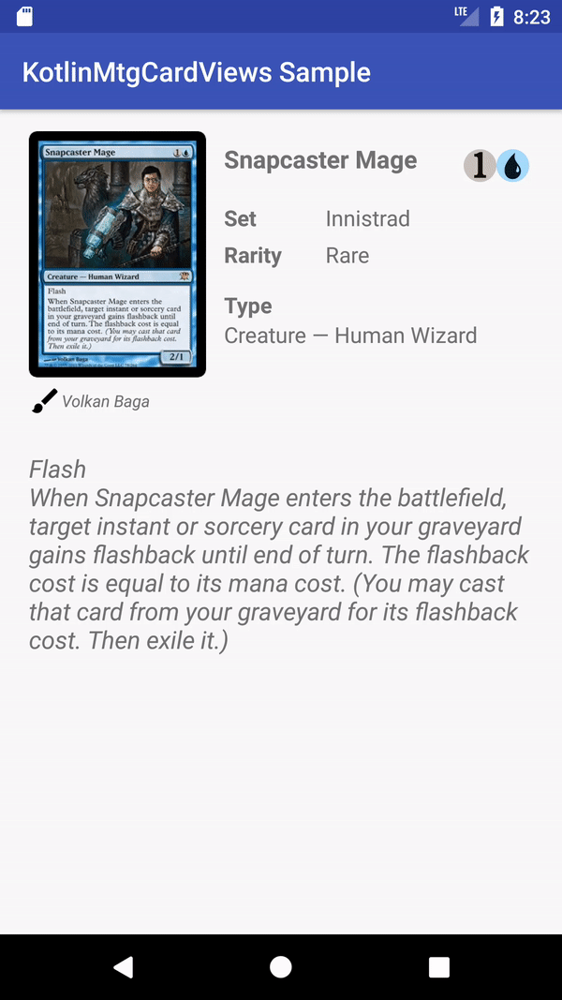

# KotlinMtgCardViews

KotlinMtgCardViews is an Android library that provides custom views to show *Magic: The Gathering* cards.

| Bintray JCenter |
|:---------------:|
| [](https://bintray.com/asantalla/develoop/kotlin-mtg-card-views/_latestVersion) |

Contents
--------

- [Download](#download)
- [Usage](#usage)
- [License](#license)

Download
--------

First of all, be sure you have the **jcenter repository** included in the `build.gradle` file in the root of your project.

```
repositories {
    jcenter()
}
```

Next, add the gradle compile dependency to the `build.gradle` file of your app module.

```
compile 'co.develoop.kotlinmtgcardviews:kotlin-mtg-card-views:1.0.0'
```

Usage
-----

We can configure our custom view with the following attributes:

* **card_multiverseId**: the *Magic: The Gathering* card multiverse id.
* **app:card_zoom**: the zoom value to be applied when the user taps on the card view. Default: *1.5*.
* **app:card_scale**: the scale value to be applied to the width, height and corner radius on the card view. Default: *1*.


```xml
<co.develoop.kotlinmtgcardviews.MtgCardImageView
    android:id="@+id/mtgCardImageView"
    android:layout_width="140dp"
    android:layout_height="180dp"
    android:layout_alignParentStart="true"
    android:layout_alignParentTop="true"
    android:clipToPadding="false"
    app:card_zoom="2" />
```



License
-------

Copyright 2017 Adrián Santalla

Licensed under the Apache License, Version 2.0 (the "License"); you may not use this file except in compliance with the License. You may obtain a copy of the License at

http://www.apache.org/licenses/LICENSE-2.0

Unless required by applicable law or agreed to in writing, software distributed under the License is distributed on an "AS IS" BASIS, WITHOUT WARRANTIES OR CONDITIONS OF ANY KIND, either express or implied. See the License for the specific language governing permissions and limitations under the License.
